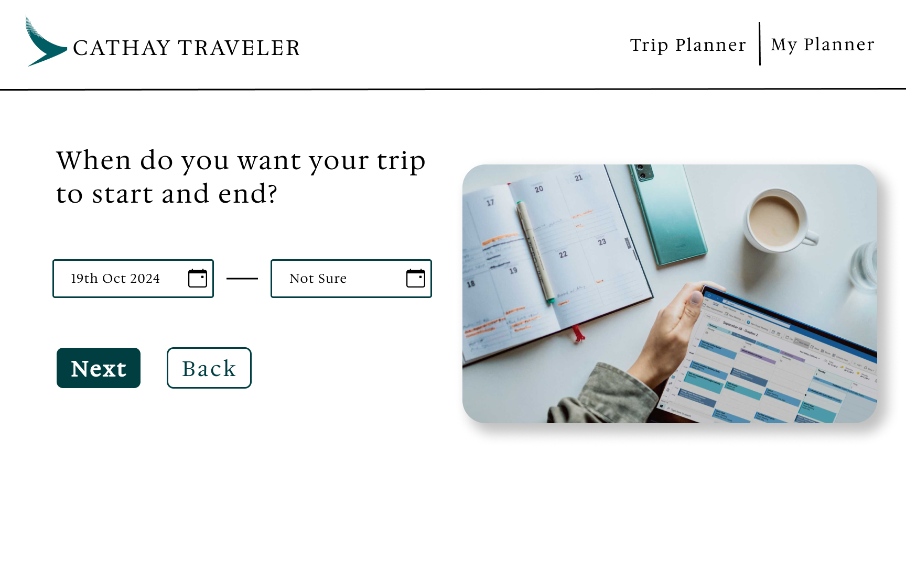
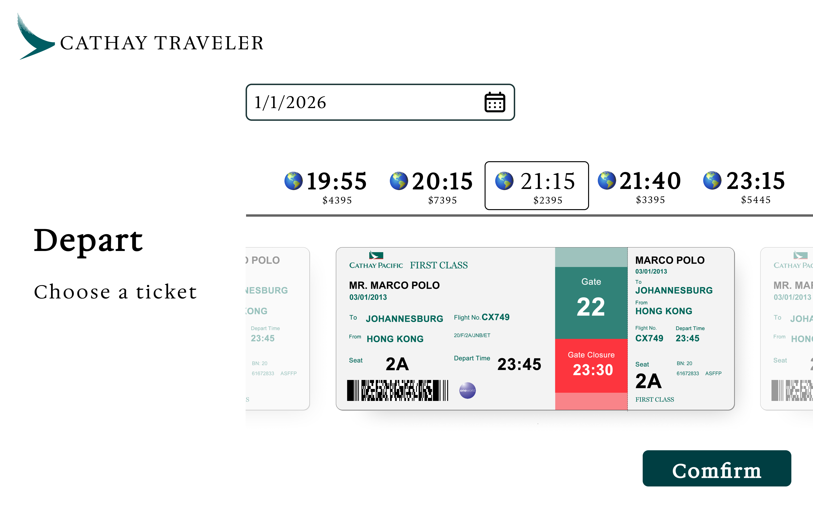
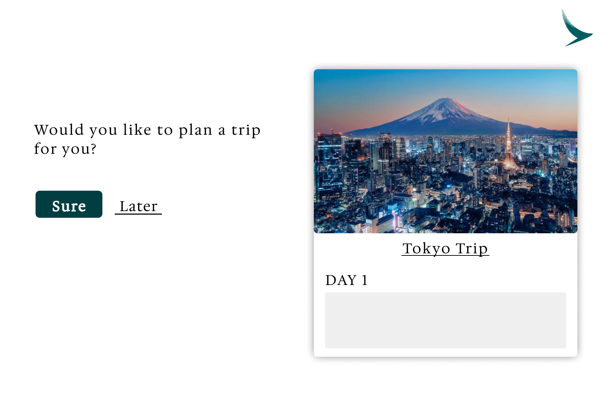
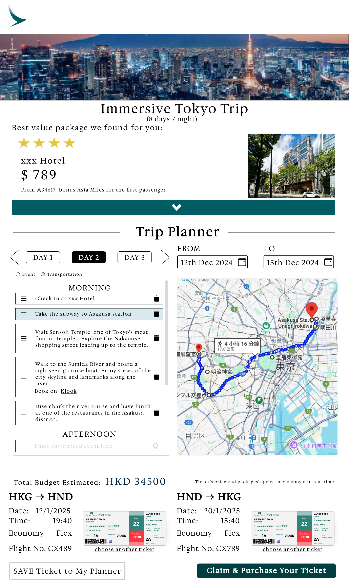
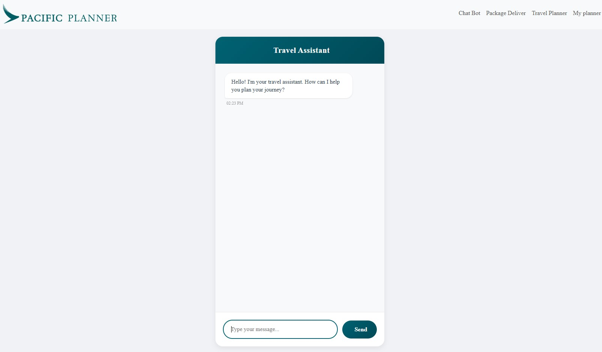
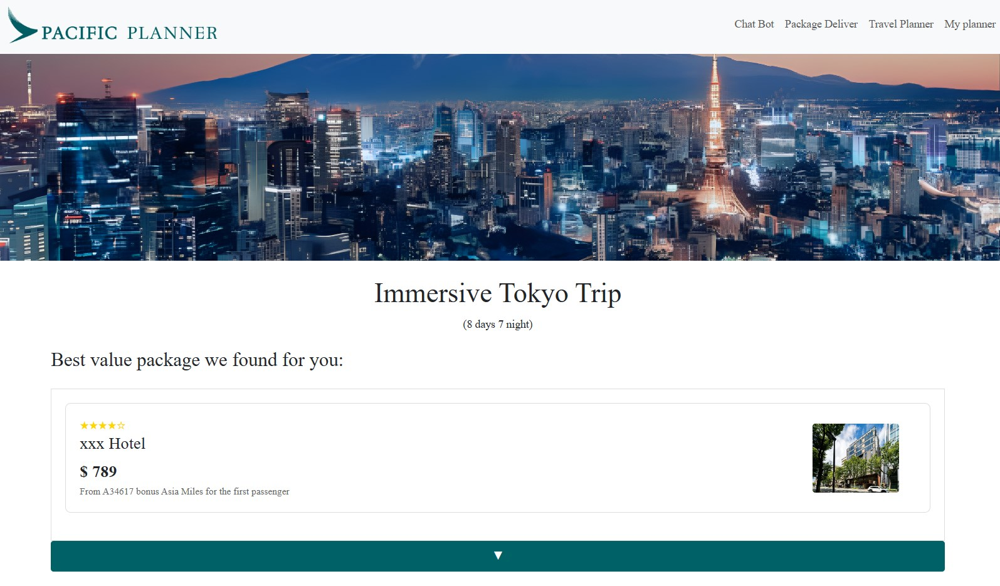
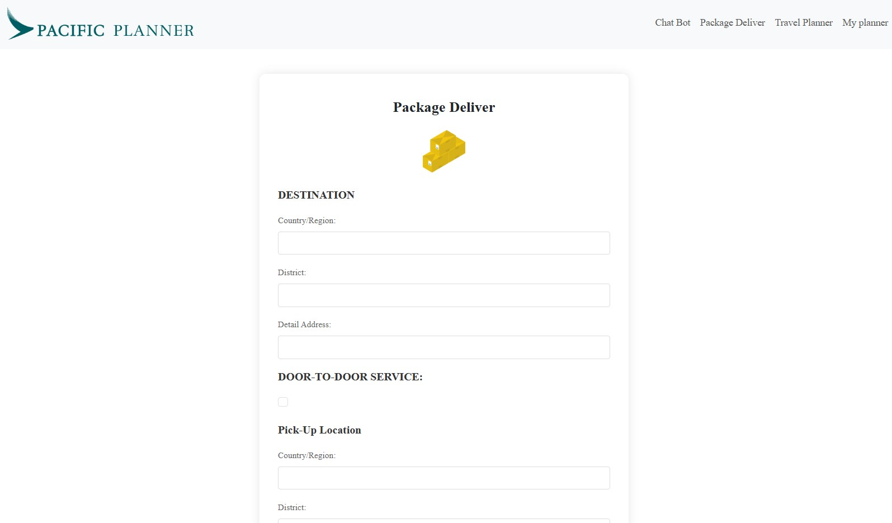
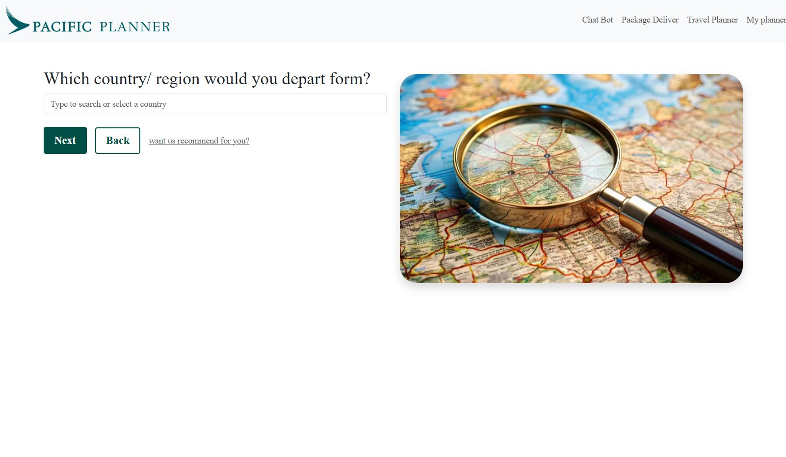

# Cathay Hackathon 2024 — Smart Travel Planner

> This project builds upon earlier concept exploration (2023), evolving into a full-stack AI-powered system design.


## Overview

This project was built for the Cathay Hackathon 2024. It is a travel planning platform designed to simplify complex international travel by helping users generate complete, personalized itineraries in a few clicks.

The system addresses common pain points in multi-leg travel, including difficulty in searching flight information, managing transfers, and coordinating bookings across multiple services.

The goal is to reduce planning friction and enable users to focus on travel decisions rather than logistics.

>Due to hackathon time constraints, this project focuses on a functional prototype demonstrating core user flows and system design rather than a fully production-ready implementation.

---

## Problem Statement

Modern travelers face multiple challenges when planning international trips:

* Difficulty finding and comparing ticket information across routes
* No centralized place to store or manage travel plans
* Confusion around transit stops and transfer routes
* Complexity in managing Cathay Pacific transfer flights and multi-leg journeys
* Fragmentation of booking systems across flights, hotels, and transport services

As a result, users often spend significant time manually coordinating travel details across multiple platforms.

---

## Solution

This platform provides a unified travel planning experience where users can:

* Generate a complete travel plan with auto route with a few clicks
* Explore destinations freely with automatically suggested transfer routes when Cathay flights are available
* View and manage flight, hotel, and transport information in one system
* Reduce manual planning effort through structured AI-assisted recommendations

The system is designed to support both first-time travelers and Cathay loyalty members with tailored experiences.

---

## Pitching Video

Watch our pitch:
https://youtu.be/Cy4qAqxQ5l8

---

## System Architecture (UML)


## System Interaction Flow (Frontend–Backend–User State)


---
## Key Features

### Smart Travel Planning

* AI-assisted generation of travel itineraries
* Automatic handling of multi-leg and transfer flights
* Simplified trip planning flow

### Unified Booking Concept

* Conceptual integration of flights, hotels, and transport into a single platform
* Centralized trip management interface

### Transfer Optimization

* Guidance for transit stops and connection routes
* Support for Cathay Pacific transfer flight scenarios

### User Personalization

* First-time users:

  * Guidance for baggage handling and transit steps
  * Simplified onboarding flow for travel planning

* Cathay members:

  * Incentive structure for earning additional Asia Miles through planned trips

* All users:

  * End-to-end trip planning in a single workflow

---

## UI/UX Design 

The entire product was designed in Figma before implementation, with a strong focus on simplifying complex travel planning into a guided and structured user flow.

The design approach prioritized:

* Reducing cognitive load in multi-leg trip planning
* Making transfer and transit information visually clear
* Ensuring a consistent and scalable design system
* Supporting both first-time users and experienced Cathay members

### Design 

The full UI was first designed in Figma, covering key user flows including itinerary generation, trip overview, and booking concept screens.

Figma Design:
<table>
  <tr>
    <td>
      
      <br/>
      
      <br/>
      
    </td>
    <td></td>
  </tr>
</table>

Figma Link:
https://www.figma.com/design/Tdzm25g9quMFj3gOfWuDWU/cathay-hackathon-2024?node-id=0-1&t=kWpwySHzXFE4W0co-1

---

### Implementation (Frontend Screenshots)

The frontend was implemented using Node js and CSS Modules, closely following the Figma design to maintain visual consistency and user experience fidelity.

Screenshots:
<div style="display: flex; gap: 10px;">
  
  
</div>
<div style="display: flex; gap: 10px;">
  
  
</div>


---

## Tech Stack

* Frontend: HTML/CSS/JS
* Backend: Node.js
* AI Integration: Llama-based model
* Database: SQL (not included in this frontend repo)
* Architecture: Separated frontend and backend for scalability
* System design consideration: extensible architecture with potential for caching layer integration (future improvement)

---

## System Design Highlights

* Clear separation between frontend and backend services to improve maintainability and scalability
* Backend designed to support AI-driven itinerary generation
* Structured data model using SQL for travel plans and user information
* Prepared architecture for future caching layer to optimize performance at scale

---

## What I Learned

* Translating real-world travel pain points into a structured product solution
* Designing a system that combines AI-generated output with user-driven planning
* Building a scalable frontend-backend architecture under hackathon constraints
* Designing a complete product UI from scratch in Figma and translating it into a functional frontend implementation
* Thinking in terms of end-to-end user experience rather than isolated features
* Working with constraints while maintaining a clean system design direction
* Collaborating in a team environment to align design, frontend, backend, and AI components under tight time constraints

---

## Future Improvements

* Integration with real airline and hotel booking APIs
* Advanced caching layer for faster itinerary generation
* Improved personalization using user travel history
* Expansion of AI model for more accurate routing and recommendation
* Mobile-first redesign for better usability

---

## Architecture Summary

The system is built with a modular structure:

Frontend (HTML/CSS/JS) -> Backend (Node.js API Layer) -> AI Service (Llama-based itinerary generation) -> SQL Database (trip + user data)

This separation allows independent scaling of UI, logic, and AI processing components.

---

## Project Goal

The goal of this project is to demonstrate the ability to:

* Translate user pain points into a product concept
* Design a scalable full-stack system
* Integrate AI into practical user workflows
* Build a working prototype under time constraints

> Again, due to hackathon time constraints, this project focuses on a functional prototype demonstrating core user flows and system design rather than a fully production-ready implementation.

---

## How to Run Locally

```
npm install
node server.js
```

